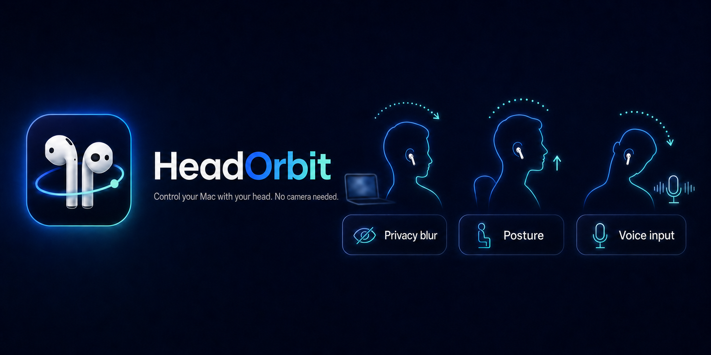
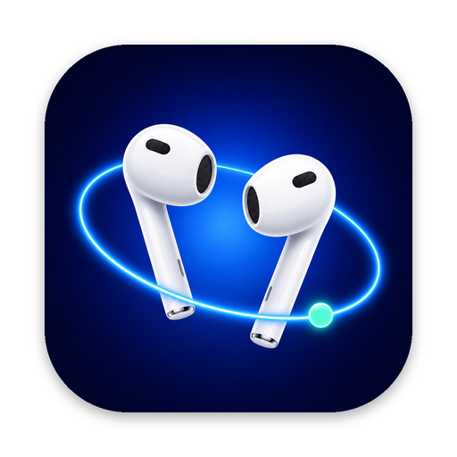
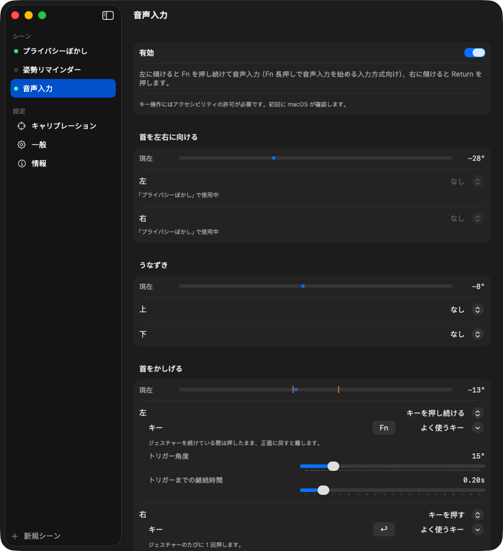
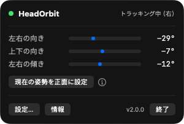

<p align="center">
  
</p>

<p align="center">
  <a href="README.md">English</a> · <a href="README.zh-CN.md">简体中文</a> · <b>日本語</b> · <a href="https://headorbit.com">headorbit.com</a>
</p>

<p align="center">
  
</p>

# HeadOrbit

AirPods の頭の動きを読み取り、Mac の操作に変える小さなメニューバーアプリです。

横を向いて誰かと話すと、画面がぼけます。首を左にかしげると音声入力が始まり、まっすぐに戻すと止まります。右にかしげれば Return キーです。手はキーボードの上でも、膝の上でも構いません。

> **ステータス：遊びで作った実験的なツールです。**
> [@bryllim_ さんのこの投稿](https://x.com/bryllim_/status/2099049704822907277)に触発されました。週末プロジェクト程度の小さなツールで、製品ではありません。粗いところがあります。

## 2.0 の新機能

- **ジェスチャーと動作を分けました。** HeadOrbit が読み取るのは、首を左右に向ける、うなずく、首をかしげる、の 3 つです。それぞれに 2 方向があり、方向ごとに 1 つの動作を割り当てます：画面をぼかす、姿勢リマインダー、キーを押す、キーを押し続ける、なし。
- **シーン。** この割り当てをひとまとめにして、まとめてオン・オフできます。3 つ内蔵されていて、自分で作ることもできます。
- **首をかしげる動きに対応。** 以前は左右とうなずきだけでした。
- **キー操作。** 「キーを押す」はジェスチャーのたびに 1 回押します。「キーを押し続ける」はジェスチャーを続けている間押したままにし、正面に戻すと離します。押している間だけ話す音声入力にちょうど合います。
- **設定ウィンドウ。** メニューバーのパネルは状態とリアルタイムの角度だけになり、設定は別ウィンドウに移りました。

0.1.x の設定はアップデート後もそのまま引き継がれます。

## 内蔵シーン

| シーン | ジェスチャー | 初期状態 |
|---|---|---|
| プライバシーぼかし | 左右に 35° 以上向いて 0.6 秒：画面をぼかす | オン |
| 姿勢リマインダー | 頭が +15° 以上上を向いて 5 秒（猫背）：ぼかして知らせる。`Esc` で 1 分停止 | オフ |
| 音声入力 | 左に 15° 以上かしげる：`Fn` を押し続ける。右に 15° 以上かしげる：`Return` を押す | オフ |

音声入力は「`Fn` 長押しで音声入力を始める」入力方式向けです。Doubao IME で動作を確認しています。左にかしげて話し、正面に戻し、右にかしげて送信します。

角度、待ち時間、キーはすべて変更できます。内蔵シーンを複製して編集することも、空のシーンから作ることもできます。1 つの方向は同時に 1 つの有効なシーンにしか属せません。2 つのシーンが同じ方向を使おうとすると、どのシーンが使用中かを表示します。

<p align="center">
  
</p>

データは Mac の外に出ません。ネットワーク通信なし、画面収録なし、アカウント不要です。

## 動作環境

- macOS 14 Sonoma 以降
- ヘッドトラッキング対応の AirPods または Beats。例：AirPods Pro（全世代）、AirPods 3 / 4、AirPods Max、Beats Fit Pro、Powerbeats Pro 2
- イヤホンは**この Mac** に接続されている必要があります。iPhone に自動で切り替わると、Mac にモーションデータが届かなくなります。
- 片耳でも両耳でも使えます。

## インストール

### 方法 1：アプリをダウンロード

[Releases](https://github.com/Cogria-AI/HeadOrbit/releases) ページから最新の `HeadOrbit-vX.Y.Z.dmg` をダウンロードして開き、`HeadOrbit` をアプリケーションフォルダにドラッグします。

Apple の公証を受けていないため、初回起動時に開発元を確認できないと表示されます。**アプリを右クリック → 開く → 開く**を選ぶか、次のコマンドを一度実行してください：

```bash
xattr -d com.apple.quarantine /Applications/HeadOrbit.app
```

### 方法 2：ソースからビルド

```bash
brew install xcodegen          # 初回のみ
git clone https://github.com/Cogria-AI/HeadOrbit.git
cd HeadOrbit
./build.sh
open build/Build/Products/Debug/HeadOrbit.app
```

Xcode 15 以降が必要です。

### アクセス許可

- **モーションとフィットネス**：初回起動時に確認されます。ぼかしと姿勢リマインダーに必要なのはこれだけです。
- **アクセシビリティ**：シーンでキー操作を使う場合のみ必要です。キーのジェスチャーを初めて使うときに macOS が確認します。システム設定 → プライバシーとセキュリティ → アクセシビリティ で HeadOrbit をオンにしてください。

HeadOrbit はメニューバーにだけ常駐するので、Dock にアイコンは出ません。

## 使い方

1. AirPods を装着し、この Mac に接続されていることを確認します。
2. メニューバーの HeadOrbit アイコンをクリックします。上部に**トラッキング中（左）**または**トラッキング中（右）**と表示されれば OK です。
3. 背筋を伸ばして画面を見たまま、**現在の姿勢を正面に設定**をクリックします。以降の角度はすべてこの姿勢が基準です。
4. **設定…**（`⌘,`）を開いて、シーンをオンにして調整します。

<p align="center">
  
</p>

パネルには左右の向き、上下の向き、傾きがリアルタイムで表示されます。右向き、上向き、右への傾きが正の値です。ジェスチャーが作動中は点がオレンジになります。

## 設定ウィンドウ

- **シーン**：各シーンのページにはスイッチと、左右・うなずき・かしげるの 3 つのセクションがあります。セクションごとにリアルタイムのゲージがあり、オレンジの線がトリガー角度です。その下に方向ごとの行があり、動作を選んでから、角度、作動までの継続時間、キーや暗さを設定します。
- **キャリブレーション**：正面の再設定と、正面の自動微調整のオン・オフ。
- **一般**：言語（English、中文、日本語）、外観、ヘッドフォンの状態、2 つのアクセス許可。
- **情報**：バージョン、[headorbit.com](https://headorbit.com)、作者への連絡先。

### 正面の自動微調整

初期状態はオフです。先に手動でキャリブレーションしてください。どのジェスチャーも作動しておらず、頭が各方向のトリガー角度の半分以内で 8 秒安定すると、「正面」を毎秒最大 0.5° ずつ補正します。各方向の補正の合計は、手動キャリブレーションからその方向のトリガー角度の 50% までです。姿勢リマインダーは常に手動の基準を使うので、猫背が基準になることはありません。椅子を動かしたら再キャリブレーションしてください。

## トラブルシューティング

**AirPods を着けているのに「ヘッドトラッキング対応のヘッドフォンが見つかりません」**
- iPhone ではなく Mac に接続されているか確認してください（コントロールセンター → サウンド）。音が AirPods から出ているだけでは足りない場合があります。それでもだめなら、Bluetooth メニューで AirPods をクリックしてこの Mac に接続し直してください。
- 一度外して着け直してください。モーションデータは装着中にだけ送られます。
- 機種がヘッドトラッキングに対応しているか確認してください（動作環境を参照）。

**アップデート後、キーのジェスチャーでアクセシビリティの確認がまた出る**
- リリース版は固定の開発者 ID で署名されていないため、macOS は新しいバージョンを別のアプリとして扱います。システム設定 → プライバシーとセキュリティ → アクセシビリティ で HeadOrbit を **−** で削除し、追加し直してください。チェックを外して付け直すだけでは直りません。

**HeadOrbit の起動中に Bluetooth マウスがカクつく**
- ヘッドトラッキング中、AirPods は Bluetooth でデータを送り続けます。一部のサードパーティ製 Bluetooth LE マウスはこれに対応できずカクつきます。macOS のログでは「Incompatible LE HID」と記録されます。Apple 製のマウスやトラックパッド、有線マウス、2.4 GHz レシーバー式のマウスは影響を受けません。

**モーションとフィットネスのアクセスが拒否された**
- システム設定 → プライバシーとセキュリティ → モーションとフィットネス → HeadOrbit をオンにします。

**ぼかしではなく、暗い板のように見える**
- HeadOrbit は Apple が公開していない WindowServer のぼかしを使っています。将来の macOS でこれがなくなった場合は、暗くするだけの表示に切り替わります。

## 今後のアイデア

- スマホを見るためにうつむく → メディアを一時停止
- しばらく画面から離れる → ロック
- 別のディスプレイの方を向く → そちらにフォーカスを移す
- ジェスチャーでショートカットを実行

どれかを実装したら、プルリクエストを歓迎します。

## ライセンス

[MIT](LICENSE) © 2026 [Cogria-AI](https://github.com/Cogria-AI)

作者 [@rfboen](https://x.com/rfboen)。
