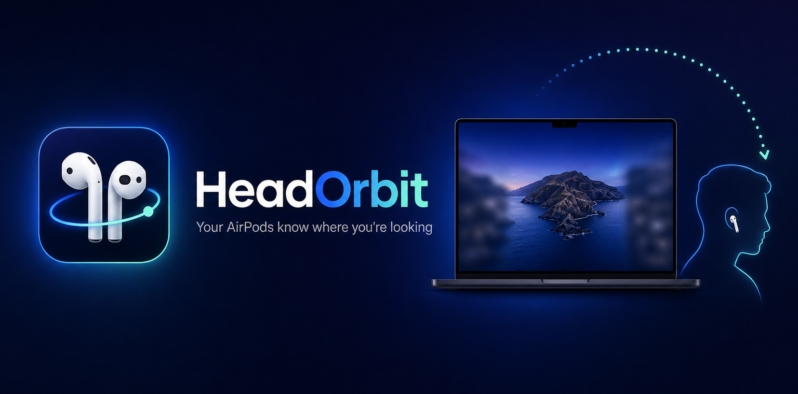
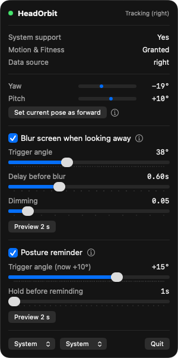

<p align="center">
  
</p>

<p align="center">
  <b>English</b> · <a href="README.zh-CN.md">简体中文</a>
</p>

# HeadOrbit

A tiny macOS menu bar app that reads head motion from your AirPods and turns it into small, useful things on screen.

Look away from the screen, and it blurs. Slouch until your chin comes up, and it nudges you to sit straight. That's it for now.

> **Status: an experiment, made for fun.**
> Inspired by [this post by @bryllim_](https://x.com/bryllim_/status/2099049704822907277). This is a weekend-project-grade tool, not a product. Expect rough edges.

## Features

- **Blur when you look away.** Turn your head left or right past a set angle and the whole screen softly blurs. Look back and it clears.
- **Posture reminder.** Calibrate while sitting straight. When you slump and your head tilts up to keep looking at the screen, HeadOrbit blurs the screen and shows a reminder until you sit up. Press `Esc` to dismiss and pause it for a minute.
- **Live head angles** in the menu, so you can see what the earbuds see.
- **One-click calibration.** Whatever pose you're in when you click becomes "forward".
- **Menu bar status icon.** Outline when nothing is connected, filled when your earbuds are streaming.
- **English / 中文**, follows the system language, switchable in the menu.
- **Light / Dark / System** appearance for the panel.

Nothing leaves your Mac. No network, no screen recording, no accounts.

## Requirements

- macOS 14 Sonoma or later
- AirPods or Beats that support head tracking, for example AirPods Pro (any generation), AirPods 3 / 4, AirPods Max, Beats Fit Pro, Powerbeats Pro 2
- The earbuds must be connected to **this Mac**. If they auto-switch to your iPhone, the Mac stops receiving motion data.
- Works with one earbud or both.

## Install

### Option 1: download the app

Grab the latest `HeadOrbit-vX.Y.Z.zip` from the [Releases](https://github.com/Cogria-AI/HeadOrbit/releases) page, unzip it, and drag `HeadOrbit.app` into your Applications folder.

The app is not notarized with Apple, so on first open macOS will say it can't verify the developer. Either **right-click the app → Open → Open**, or run this once:

```bash
xattr -d com.apple.quarantine /Applications/HeadOrbit.app
```

### Option 2: build from source

```bash
brew install xcodegen          # once
git clone https://github.com/Cogria-AI/HeadOrbit.git
cd HeadOrbit
./build.sh
open build/Build/Products/Debug/HeadOrbit.app
```

Xcode 15 or later is required.

### First launch

macOS asks for **Motion & Fitness** access. Allow it, that's the only permission HeadOrbit needs. HeadOrbit lives in the menu bar only, so there is no Dock icon and no window to look for.

## Usage

1. Put on your AirPods and make sure they're connected to the Mac.
2. Click the HeadOrbit icon in the menu bar. The header should read **Tracking (left)** or **Tracking (right)**, telling you which earbud is providing data.
3. Sit straight, look at the screen, and click **Set current pose as forward**. Every angle is measured from this pose, so recalibrate whenever you move your chair or your mood.
4. Turn on the features you want and tune the sliders.

<p align="center">
  
</p>

Hover the small ⓘ icons in the menu for a one-line explanation of each feature.

## Configuration

### Blur when looking away

| Setting | What it does | Default |
|---|---|---|
| Trigger angle | How far left or right your head must turn before the screen counts as "not being looked at" | 35° |
| Delay before blur | How long you must stay turned away before it triggers, so a quick glance doesn't count | 0.6 s |
| Dimming | Extra darkening on top of the blur | 0.15 |

### Posture reminder

| Setting | What it does | Default |
|---|---|---|
| Trigger angle | Head pitch relative to your calibrated pose. Positive watches head-up only (slouching), negative watches head-down only | +15° |
| Hold before reminding | How long the bad posture must persist. Slouching happens slowly, so this is measured in seconds, not fractions | 5 s |

The reminder is off by default because it only makes sense after calibrating. While it's showing, press `Esc` or click **Dismiss, pause 1 min** in the menu.

### Language and appearance

Both live at the bottom of the menu. Language defaults to Chinese if your system is Chinese, English otherwise.

## Troubleshooting

**"No head-tracking headphones"** while wearing AirPods
- Check they're connected to the Mac, not your iPhone (Control Center → Sound).
- Take them out and put them back in. Motion data only streams while they're worn.
- Make sure the model supports head tracking (see Requirements).

**Motion & Fitness access denied**
- System Settings → Privacy & Security → Motion & Fitness → enable HeadOrbit.
- If you rebuild the app yourself, macOS may ask again. That's expected with a locally signed build.

**The blur looks like a flat dark sheet instead of blur**
- HeadOrbit uses a WindowServer blur that Apple doesn't document. If a future macOS removes it, the overlay falls back to plain dimming.

## Ideas for later

- Look down at your phone → pause media
- Quick head flick → next track or next desktop
- Away from the screen for a while → lock
- Turn your head toward another display → move focus there

If you build any of these, a pull request is very welcome.

## License

[MIT](LICENSE) © 2026 [Cogria-AI](https://github.com/Cogria-AI)

Made by [@rfboen](https://x.com/rfboen).
