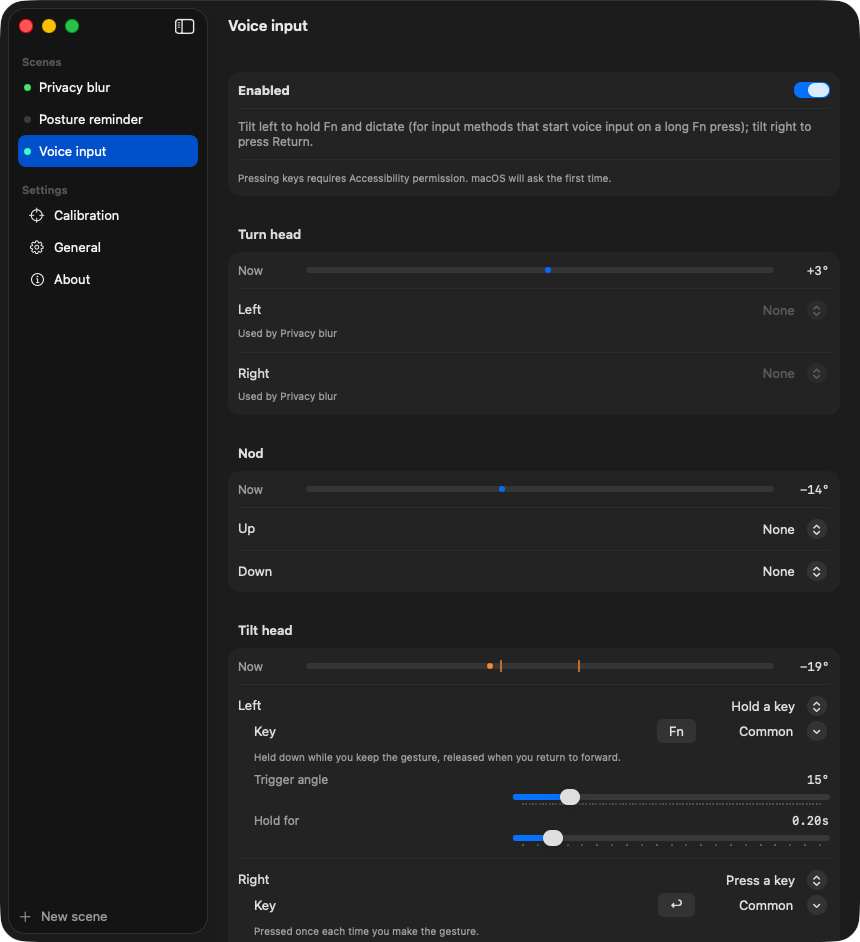
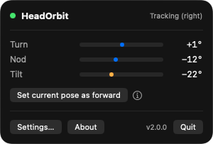

<p align="center">
  
</p>

<p align="center">
  <b>English</b> · <a href="README.zh-CN.md">简体中文</a> · <a href="README.ja.md">日本語</a> · <a href="https://headorbit.com">headorbit.com</a>
</p>

<p align="center">
  
</p>

# HeadOrbit

**Control your Mac with your head. No camera needed.**

HeadOrbit is a small macOS menu bar app. It reads the motion sensors already inside your AirPods and turns head movements into actions on your Mac.

Turn away to talk to someone and the screen blurs. Tilt your head left and your voice input starts listening; straighten up and it stops. Tilt right and it presses Return. Your hands stay on the keyboard, or off it.

> **Status: an experiment, made for fun.**
> Inspired by [this post by @bryllim_](https://x.com/bryllim_/status/2099049704822907277). This is a weekend-project-grade tool, not a product. Expect rough edges.

## What's new in 2.1

- **Neck exercise.** Click **Neck exercise** in the menu bar panel. The screen blurs and shows a path to follow with your head: a clockwise neck roll, a counterclockwise one, then a figure 8, 3 times each. The dot is your head, and it waits if you fall behind. Press `Esc` to stop at any time.
- **Automatic updates.** HeadOrbit checks GitHub for a new version once at launch, downloads it, and asks before restarting. You can also check by hand in Settings → About. Coming from 2.0, you still need to download this one manually.

## What's new in 2.0

- **Gestures and actions are separate.** HeadOrbit reads three head movements: turn, nod and tilt. Each has two directions, and each direction can do one thing: blur the screen, show a posture reminder, press a key, hold a key, or nothing.
- **Scenes.** A scene is a set of those choices that you switch on or off as a unit. Three come built in, and you can make your own.
- **Tilt is new.** Earlier versions only used turn and nod.
- **Key actions.** "Press a key" fires once per gesture. "Hold a key" keeps the key down while you hold the gesture and releases it when you return to forward, which is what push-to-talk voice input needs.
- **Settings window.** The menu bar panel now only shows status and live angles. Everything else lives in a separate window.

Settings from 0.1.x carry over automatically.

## Built-in scenes

| Scene | Gestures | Default |
|---|---|---|
| Privacy blur | Turn left or right past 35° for 0.6 s: blur the screen | On |
| Posture reminder | Head tilts up past +15° for 5 s (you slouched): blur with a reminder, `Esc` pauses it for a minute | Off |
| Voice input | Tilt left past 15°: hold `Fn`. Tilt right past 15°: press `Return` | Off |

Voice input is meant for input methods that start dictation while `Fn` is held down. We tested it with Doubao IME. Tilt left, speak, straighten up, tilt right to send.

You can change any angle, delay or key, duplicate a built-in scene, or start an empty one. A direction can belong to only one enabled scene at a time; if two scenes want the same direction, HeadOrbit tells you which one is using it.

<p align="center">
  
</p>

Nothing leaves your Mac. No screen recording, no accounts. The only network request is the update check against GitHub Releases, and nothing is uploaded.

## Requirements

- macOS 14 Sonoma or later
- AirPods or Beats that support head tracking, for example AirPods Pro (any generation), AirPods 3 / 4, AirPods Max, Beats Fit Pro, Powerbeats Pro 2
- The earbuds must be connected to **this Mac**. If they auto-switch to your iPhone, the Mac stops receiving motion data.
- Works with one earbud or both.

## Install

### Option 1: download the app

Grab the latest `HeadOrbit-vX.Y.Z.dmg` from the [Releases](https://github.com/Cogria-AI/HeadOrbit/releases) page, open it, and drag `HeadOrbit` into the Applications folder.

The app is not notarized with Apple, so on first open macOS will say it can't verify the developer. Either **right-click the app → Open → Open**, or run this once:

```bash
xattr -d com.apple.quarantine /Applications/HeadOrbit.app
```

### Option 2: build from source

```bash
brew install xcodegen          # once
git clone https://github.com/Cogria-AI/HeadOrbit.git
cd HeadOrbit
./build.sh
open build/Build/Products/Debug/HeadOrbit.app
```

Xcode 15 or later is required.

### Permissions

- **Motion & Fitness** is asked on first launch. Blur and posture reminders need nothing else.
- **Accessibility** is only needed when a scene presses keys. macOS asks the first time a key gesture fires. Allow HeadOrbit in System Settings → Privacy & Security → Accessibility.

HeadOrbit lives in the menu bar only, so there is no Dock icon.

## Usage

1. Put on your AirPods and make sure they're connected to the Mac.
2. Click the HeadOrbit icon in the menu bar. The header should read **Tracking (left)** or **Tracking (right)**.
3. Sit straight, look at the screen, and click **Set current pose as forward**. Every angle is measured from this pose.
4. Open **Settings…** (`⌘,`) to turn scenes on and tune them.

<p align="center">
  
</p>

The panel shows turn, nod and tilt live. Right turn, head up and right tilt are positive. A dot turns orange while a gesture is active.

## Settings window

- **Scenes.** Each scene page has a switch and three sections: turn, nod, tilt. Each section has a live gauge with orange marks at the trigger angles, then one row per direction: pick an action, then set its angle, how long to hold before it fires, and the key or dimming.
- **Calibration.** Recalibrate forward, and turn on automatic forward adjustment.
- **General.** Language (English, 中文, 日本語), appearance, headphone status and both permissions.
- **About.** Version, update check, [headorbit.com](https://headorbit.com) and a link to the author.

### Automatic forward adjustment

Off by default. Calibrate manually first. When nothing is triggered and your head stays within half of each trigger angle for 8 seconds, HeadOrbit shifts "forward" by up to 0.5° per second. The total shift in each direction is capped at 50% of that direction's trigger angle from your manual calibration. Posture reminders always use the manual reference, so slouching never becomes the new normal. Recalibrate after moving your chair.

## Troubleshooting

**"No head-tracking headphones"** while wearing AirPods
- Check they're connected to the Mac, not your iPhone (Control Center → Sound). Sound playing through the AirPods is not enough; if it still fails, click the AirPods in the Bluetooth menu to connect them to this Mac.
- Take them out and put them back in. Motion data only streams while they're worn.
- Make sure the model supports head tracking (see Requirements).

**A key gesture shows the Accessibility prompt again after an update**
- The release build is not signed with a fixed developer identity, so macOS treats each new version as a new app. In System Settings → Privacy & Security → Accessibility, remove HeadOrbit with **−** and add it again. Unticking and ticking is not enough.

**My Bluetooth mouse lags while HeadOrbit is running**
- Head tracking keeps a constant Bluetooth stream from the AirPods. Some third-party Bluetooth LE mice can't adjust to it and stutter; macOS logs them as "Incompatible LE HID". Apple mice and trackpads, wired mice, or mice with a 2.4 GHz receiver are not affected.

**Motion & Fitness access denied**
- System Settings → Privacy & Security → Motion & Fitness → enable HeadOrbit.

**The blur looks like a flat dark sheet instead of blur**
- HeadOrbit uses a WindowServer blur that Apple doesn't document. If a future macOS removes it, the overlay falls back to plain dimming.

## Ideas for later

- Look down at your phone → pause media
- Away from the screen for a while → lock
- Turn your head toward another display → move focus there
- Run a Shortcut from a gesture

If you build any of these, a pull request is very welcome.

## License

[MIT](LICENSE) © 2026 [Cogria-AI](https://github.com/Cogria-AI)

Made by [@rfboen](https://x.com/rfboen).
