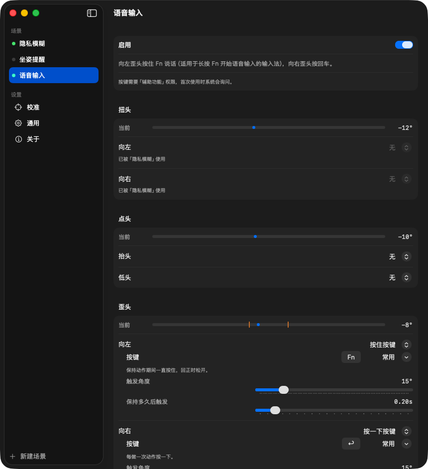
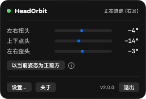

<p align="center">
  
</p>

<p align="center">
  <a href="README.md">English</a> · <b>简体中文</b> · <a href="README.ja.md">日本語</a> · <a href="https://headorbit.com">headorbit.com</a>
</p>

<p align="center">
  
</p>

# HeadOrbit

一个很小的 macOS 菜单栏应用。它读取 AirPods 的头部运动数据，把头的动作变成 Mac 上的操作。

转头和同事说话，屏幕自动模糊。向左歪头，输入法开始听写；头摆正，听写结束。再向右歪一下，就是按了回车。手可以一直放在键盘上，也可以不放。

> **状态：实验性质，做着玩的。**
> 创意灵感来自 [@bryllim_ 的这条推文](https://x.com/bryllim_/status/2099049704822907277)。这是一个周末项目级别的小工具，不是产品，边角会有点糙。

## 2.0 有什么新东西

- **动作和行为分开了。** HeadOrbit 识别三个头部动作：扭头、点头、歪头。每个动作分两个方向，每个方向可以做一件事：模糊屏幕、坐姿提醒、按一下某个键、按住某个键，或者什么都不做。
- **场景。** 一个场景就是一组这样的设置，可以整体开关。内置三个，也可以自己建。
- **新增歪头。** 以前只用扭头和点头。
- **按键行为。** 「按一下」每做一次动作按一次。「按住」在保持动作期间一直按着，回正时松开，长按说话的语音输入正好要这个。
- **设置窗口。** 菜单栏面板只留状态和实时角度，其余设置都搬进了单独的窗口。

0.1.x 的设置升级后会自动保留。

## 内置场景

| 场景 | 动作 | 默认 |
|---|---|---|
| 隐私模糊 | 向左或向右扭头超过 35°，持续 0.6 秒：模糊屏幕 | 开 |
| 坐姿提醒 | 抬头超过 +15°，持续 5 秒（塌腰了）：模糊并提示坐直，按 `Esc` 暂停 1 分钟 | 关 |
| 语音输入 | 向左歪头超过 15°：按住 `Fn`。向右歪头超过 15°：按回车 | 关 |

语音输入适用于「长按 `Fn` 开始听写」的输入法，我们用豆包输入法实测过。左歪头说话，回正，右歪头发送。

角度、延时、按键都可以改。内置场景可以复制一份再改，也可以新建空场景。同一个方向同时只能属于一个开着的场景，两个场景抢同一个方向时，HeadOrbit 会告诉你被哪个场景占用了。

<p align="center">
  
</p>

所有数据都留在你的 Mac 上。不联网，不录屏，不需要账号。

## 要求

- macOS 14 Sonoma 或更新
- 支持头部追踪的 AirPods 或 Beats，例如 AirPods Pro（任意代）、AirPods 3 / 4、AirPods Max、Beats Fit Pro、Powerbeats Pro 2
- 耳机必须连接到**这台 Mac**。如果它自动切到了 iPhone，Mac 就收不到运动数据。
- 戴一只或两只都可以。

## 安装

### 方式一：直接下载

到 [Releases](https://github.com/Cogria-AI/HeadOrbit/releases) 页面下载最新的 `HeadOrbit-vX.Y.Z.dmg`，打开后把 `HeadOrbit` 拖进「应用程序」文件夹。

这个应用没有经过 Apple 公证，第一次打开时 macOS 会提示无法验证开发者。**右键点击应用 → 打开 → 打开**即可，或者执行一次：

```bash
xattr -d com.apple.quarantine /Applications/HeadOrbit.app
```

### 方式二：源码编译

```bash
brew install xcodegen          # 只需一次
git clone https://github.com/Cogria-AI/HeadOrbit.git
cd HeadOrbit
./build.sh
open build/Build/Products/Debug/HeadOrbit.app
```

需要 Xcode 15 或更新。

### 权限

- **运动与健身**：第一次启动时询问。模糊和坐姿提醒只需要这一项。
- **辅助功能**：只有场景里用到按键时才需要。第一次触发按键动作时系统会询问，在 系统设置 → 隐私与安全性 → 辅助功能 里打开 HeadOrbit。

HeadOrbit 只住在菜单栏里，没有 Dock 图标。

## 使用

1. 戴上 AirPods，确认它连接的是这台 Mac。
2. 点菜单栏里的 HeadOrbit 图标。顶部应显示**正在追踪（左耳）**或**正在追踪（右耳）**。
3. 坐直、平视屏幕，点**以当前姿态为正前方**。之后所有角度都相对这个姿态计算。
4. 点**设置…**（`⌘,`）打开场景并调整参数。

<p align="center">
  
</p>

面板实时显示扭头、点头、歪头三个角度。右转、抬头、右歪为正。有动作正在触发时，对应的圆点变成橙色。

## 设置窗口

- **场景**：每个场景页有一个开关，下面分扭头、点头、歪头三组。每组一条实时角度条，橙色竖线是触发角度；下面每个方向一行，先选行为，再设触发角度、保持多久后触发，以及按键或压暗程度。
- **校准**：重新校准正前方，开关自动微调。
- **通用**：语言（English、中文、日本語）、外观、耳机状态、两项权限。
- **关于**：版本号、[headorbit.com](https://headorbit.com)、作者联系方式。

### 自动微调正前方

默认关闭，开之前先手动校准。没有任何动作在触发、头在各方向触发角度的一半以内稳定 8 秒后，HeadOrbit 以每秒最多 0.5° 的速度修正「正前方」。每个方向的总修正量不超过该方向触发角度的 50%（相对手动校准）。坐姿提醒始终用手动基准，不会把塌腰学成正常姿态。挪了椅子之后请重新校准。

## 常见问题

**戴着 AirPods 却显示「未检测到支持头部追踪的耳机」**
- 确认耳机连的是 Mac 而不是 iPhone（控制中心 → 声音）。声音从 AirPods 出来还不够；仍然不行的话，在蓝牙菜单里点一下 AirPods，把它连到这台 Mac。
- 摘下来再戴上。只有戴着的时候才会传运动数据。
- 确认型号支持头部追踪（见「要求」）。

**升级后，按键动作又弹出辅助功能授权**
- 发布版没有用固定的开发者身份签名，macOS 会把每个新版本当成新应用。在 系统设置 → 隐私与安全性 → 辅助功能 里用 **−** 删掉 HeadOrbit，再重新添加。只取消勾选再勾上不管用。

**HeadOrbit 运行时蓝牙鼠标会卡**
- 头部追踪期间，AirPods 会持续通过蓝牙传数据。部分第三方蓝牙 LE 鼠标适应不了，会卡顿，macOS 日志里会把它们标成「Incompatible LE HID」。苹果的鼠标和触控板、有线鼠标、2.4G 接收器鼠标不受影响。

**运动与健身权限被拒绝**
- 系统设置 → 隐私与安全性 → 运动与健身 → 打开 HeadOrbit。

**模糊效果看起来像一层平的深色，不像模糊**
- HeadOrbit 用的是 WindowServer 里一个 Apple 没有公开的模糊接口。如果未来的 macOS 把它去掉了，遮罩会退化成只压暗。

## 以后可能做的

- 低头看手机 → 暂停正在播放的媒体
- 离开屏幕一段时间 → 锁屏
- 转头看向另一块显示器 → 把焦点切过去
- 用动作运行一个快捷指令

如果你做了其中任何一个，非常欢迎提 Pull Request。

## 许可

[MIT](LICENSE) © 2026 [Cogria-AI](https://github.com/Cogria-AI)

作者 [@rfboen](https://x.com/rfboen)。
